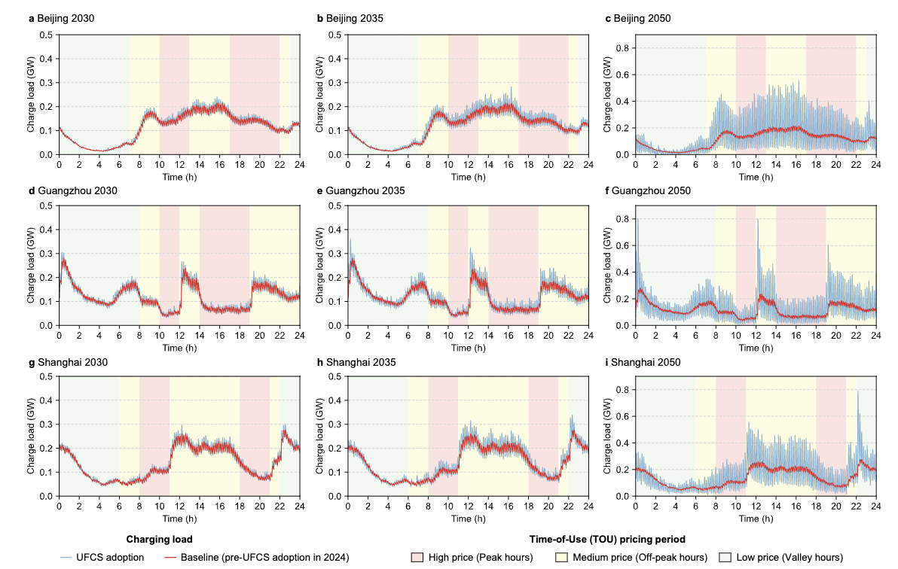

# Paper Published | Nature Communications | China's urban EV ultra-fast charging distorts regulated price signals and elevates risk to grid stability

Original Title: China's urban EV ultra-fast charging distorts regulated price signals and elevates risk to grid stability

Link: [https://doi.org/10.1038/s41467-025-63199-3](https://doi.org/10.1038/s41467-025-63199-3)

## Background

With the rapid adoption of electric vehicles in Chinese cities, the deployment of ultra-fast charging infrastructure is accelerating. However, the high power demand of ultra-fast charging may significantly impact grid stability and distort existing electricity pricing mechanisms. This study provides an in-depth analysis of these issues to inform policy development.

## Key Findings

By analyzing EV charging data from multiple Chinese cities, this study found:

1. The high power demand of ultra-fast charging is temporally misaligned with current time-of-use pricing policies
2. User charging behavior fails to effectively respond to price signals, exacerbating grid pressure during peak load periods
3. Concentrated deployment of ultra-fast charging stations may cause local grid overload risks

## Policy Implications

The findings indicate a need to revisit existing pricing policies and charging infrastructure planning strategies to ensure the large-scale adoption of EVs is coordinated with stable grid operations.

## Publication Info

- **Journal**: Nature Communications
- **Authors**: Qing Yu, Pengjun Zhao, Jiaxing Li, Han Wang, Jie Yan & Haoran Zhang
- **DOI**: 10.1038/s41467-025-63199-3
